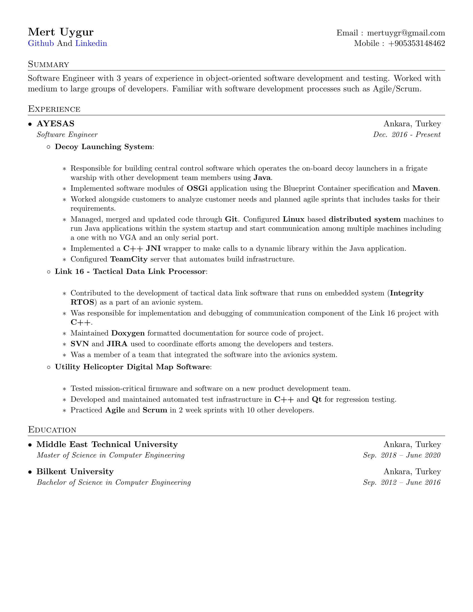

# 👨‍💻Resume 

 

This is my single page LaTeX based resume, built with Travis CI (free for public repos) and deployed to GitHub Releases on each change. 
The deployment includes compiled PDF and first page PDF preview.

release page [here](https://github.com/mertuygr/resume/releases)

## Features
* Easy to edit and build
* Easy to version
* Clear and structured
* Built with Travis CI 😱

### References
* [Template base and inspiration](https://github.com/sb2nov/resume)

